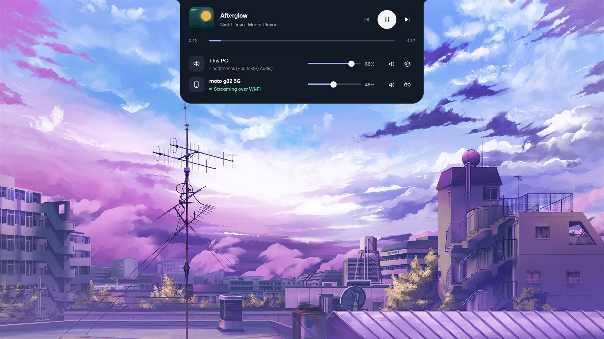
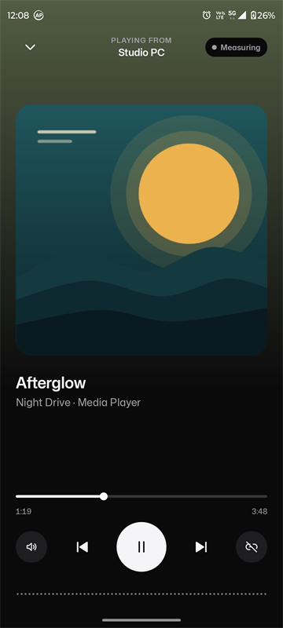
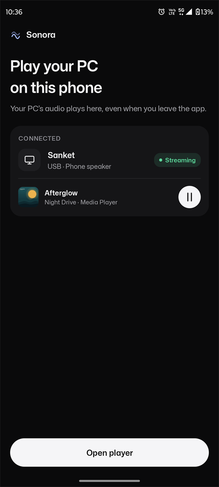
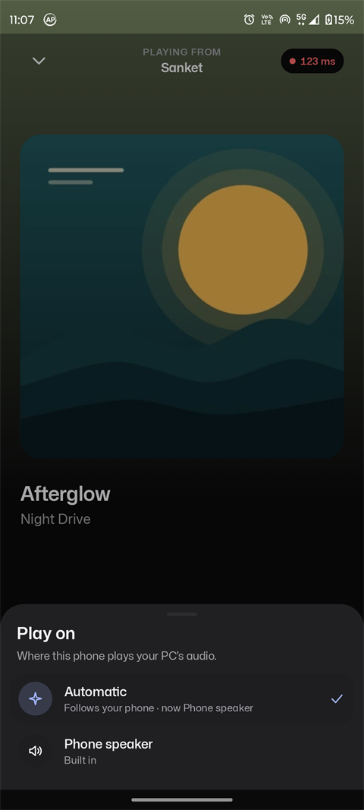
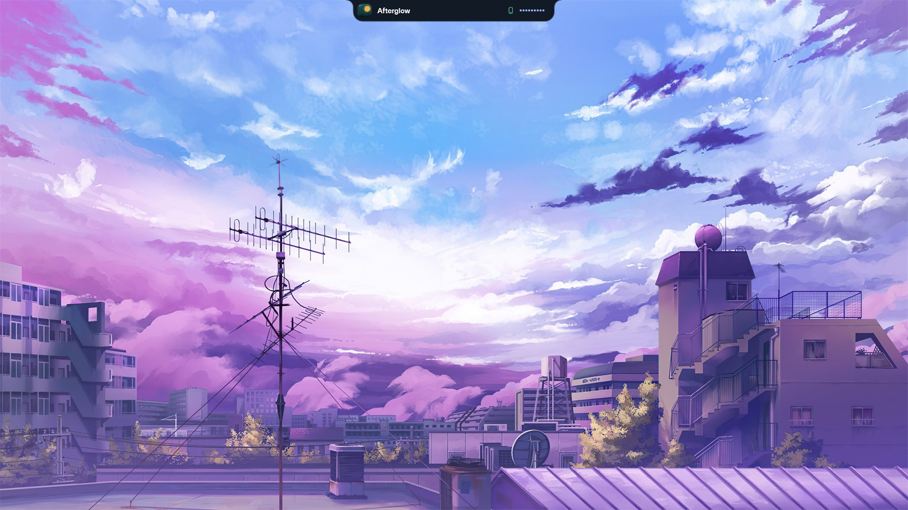
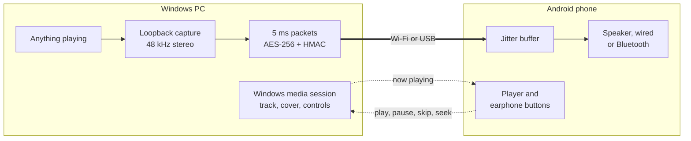

<div align="center">


# Sonora

**Your PC's sound, on your phone.**

Stream everything your Windows PC plays to an Android phone over Wi‑Fi or a USB cable,<br>
with the song, cover art and controls on both screens.

[](https://github.com/Sanket-Gawande/sonora/releases/latest)
[](#get-started)
[](#get-started)
[](#progress)

[**Download**](https://github.com/Sanket-Gawande/sonora/releases/latest) &nbsp;·&nbsp; [Get started](#get-started) &nbsp;·&nbsp; [How it works](#how-it-works) &nbsp;·&nbsp; [Roadmap](#coming-next)

<br>



<sub>The notch on Windows, open: what's playing, the PC's volume, and the phone it's streaming to.</sub>

<br><br>


&nbsp;&nbsp;

&nbsp;&nbsp;


<sub>On the phone: the player (with Mute PC), home with the PC found on Wi‑Fi, and the output picker.</sub>

</div>

## Why Sonora

<table>
<tr>
<td width="50%" valign="top">

**📶 Wi‑Fi or USB, one tap**<br>
Open the app and your PC shows up on your Wi‑Fi (or the phone's hotspot). Allow the phone on the PC once, then it's one tap. No account, no cloud. USB works too.

</td>
<td width="50%" valign="top">

**🎵 A real music player**<br>
Title, artist, cover and position from whatever plays on the PC (Spotify, YouTube in a browser, Media Player), with previous, play/pause, next and seek.

</td>
</tr>
<tr>
<td valign="top">

**🎧 Your earphones work, the PC can go quiet**<br>
Earphone buttons control the PC. Mute the PC's speakers from the phone so only the phone plays, and open the song on the phone with one tap.

</td>
<td valign="top">

**⏱️ Low latency, measured**<br>
About 130 ms from the PC to the phone's speaker over Wi‑Fi, measured end to end and shown in colour. The buffer adapts to the network and shrinks while it's steady.

</td>
</tr>
<tr>
<td valign="top">

**🔒 Private by design**<br>
Audio is sealed with AES‑256 and HMAC‑SHA256. On Wi‑Fi the phone pairs once with a number you confirm on the PC; keys are derived on both sides and never sent.

</td>
<td valign="top">

**🪟 A notch that stays out of the way**<br>
Opens with a click or <kbd>Ctrl</kbd>+<kbd>Alt</kbd>+<kbd>S</kbd>, shows the PC's volume and the phone, jumps to the tab that's playing, and warns when nobody can hear it.

</td>
</tr>
</table>

<div align="center">

<sub>Closed, the notch is a slim bar with the track, the phone and a live level.</sub>
</div>

## Get started

| | Download | You need |
|---|---|---|
| **Windows** | [`Sonora-Windows-0.5.zip`](https://github.com/Sanket-Gawande/sonora/releases/download/v0.5.0/Sonora-Windows-0.5.zip) | Windows 10 or 11 |
| **Android** | [`Sonora-Android-0.5.apk`](https://github.com/Sanket-Gawande/sonora/releases/download/v0.5.0/Sonora-Android-0.5.apk) | Android 8.0 or later |

1. **Windows:** extract the zip anywhere and run `Sonora.exe`. Windows asks once whether Sonora may accept connections on your network: allow it.
2. **Android:** install the APK and open Sonora. Your PC shows up when both are on the same Wi‑Fi (or the PC is on the phone's hotspot).
3. **Tap Connect over Wi‑Fi.** The first time, the phone and the notch show the same number: click **Allow** on the PC. After that it's one tap.

<details>
<summary><b>Over USB instead</b></summary>

Extract Google's [platform-tools](https://developer.android.com/tools/releases/platform-tools) next to `Sonora.exe` (or have Android Studio), turn on **USB debugging** on the phone (*Settings › About phone*, tap *Build number* 7 times, then *Developer options › USB debugging*), plug in, tap **Allow**, then **Use USB** in the app.

</details>

Sonora adds itself to the Start menu on first run, so after a restart it's one search away. Want it running all the time? Turn on **Start with Windows** in its settings.

> [!NOTE]
> These are preview builds. The Windows app isn't signed yet, so Windows may ask you to confirm the first run, and the APK is installed by sideloading.

## How it works



Sonora captures the PC's output as it's mixed, cuts it into 5 ms encrypted packets and sends them to the phone: as UDP on Wi‑Fi, or over the cable with `adb reverse`. The phone reorders them, fills any gap and plays them through an adaptive buffer. A second channel finds the PC (a broadcast and multicast query on Wi‑Fi), pairs, connects, shows what's playing, sends media commands and syncs clocks to measure latency. The full protocol is in [docs/protocol.md](docs/protocol.md).

## Progress

| | Status |
|---|---|
| USB streaming, Windows → Android | ✅ Working |
| Phone finds the PC and connects in one tap | ✅ Working |
| Now playing on the phone, with controls and earphone buttons | ✅ Working |
| Measured end-to-end latency | ✅ Working |
| Output picker: speaker, wired, USB, Bluetooth | ✅ Working |
| Windows notch: hotkey, tray, Start menu, fullscreen-aware, wallpaper colour | ✅ Working |
| Wi‑Fi discovery, pairing and streaming | ✅ Working |
| PC volume in the notch, Mute PC from the phone, "nobody hears this" warning | ✅ Working |
| Open the song on the phone, jump to the playing tab on the PC | ✅ Working |

## Coming next

- **Even lower latency**: Opus compression and clock-drift correction.
- **Encrypted control channel** on Wi‑Fi (titles and button presses; the audio already is).
- **Lock-screen and notification** media controls on the phone.
- **Signed builds** and a Windows installer.

## Build from source

<details>
<summary><b>Windows</b>: no SDK needed, it uses the C# compiler that ships with Windows</summary>

```powershell
cd apps\windows
.\build.ps1 -Verify        # build\Sonora\Sonora.exe, a zip, and a self-check with snapshots
```

</details>

<details>
<summary><b>Android</b>: JDK 17 (Android Studio's bundled one works)</summary>

```powershell
cd apps\android
.\gradlew.bat assembleDebug testDebugUnitTest
```

</details>

Each app's README ([Windows](apps/windows/README.md), [Android](apps/android/README.md)) covers its layout and self-tests.

```
apps/windows/   the Windows notch (WPF, .NET Framework 4.8)
apps/android/   the Android player (Kotlin, Jetpack Compose)
docs/           protocol and product notes, screenshots
design/         the original concept
```

<sub>Sonora uses the <a href="https://github.com/github/mona-sans">Mona Sans</a> typeface (SIL Open Font License 1.1). The demo track in the screenshots, "Afterglow", and its cover were made for this project.</sub>
