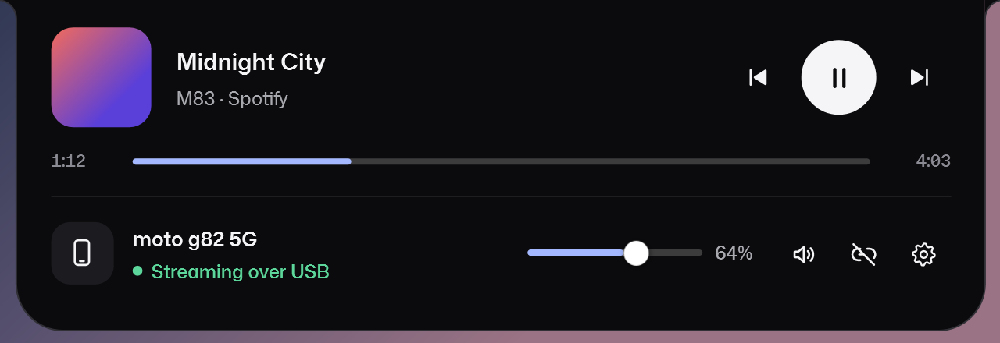
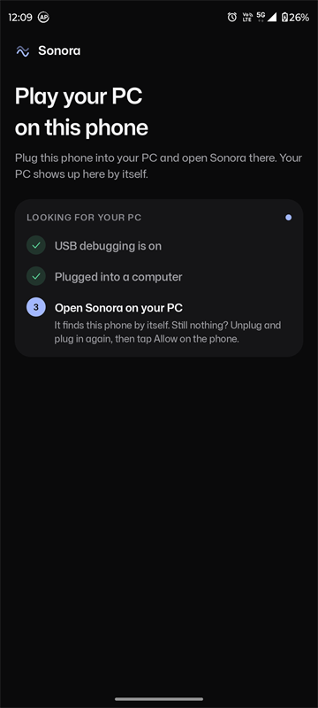
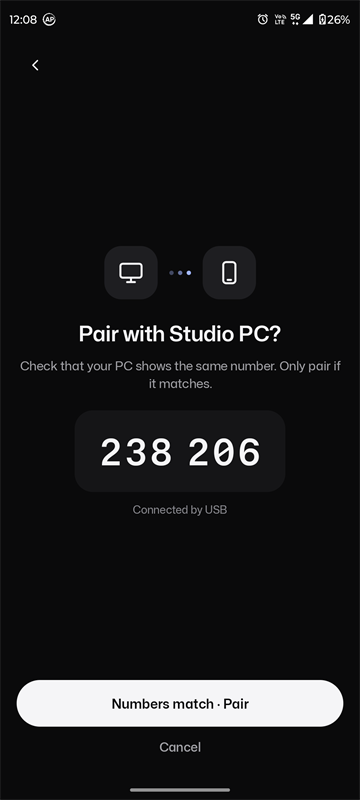
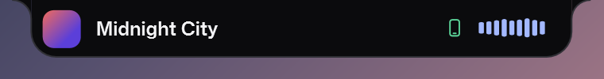

# Sonora

**Play your Windows PC's audio on your Android phone, over a USB cable.**

Sonora has two apps. On Windows it's a small notch on the top edge of the screen. On Android it's a music player that plays whatever your PC plays. Plug the phone in, tap Connect, and the PC's sound comes out of the phone, with the song, cover art and controls on screen. No account, no cloud and no Wi‑Fi setup.

<p align="center">
  
  &nbsp;&nbsp;
  
</p>
<p align="center">
  
</p>

## Features

- **One-tap connect.** Plug the phone in and your PC shows up in the app. Tap Connect.
- **A real player.** The song, artist, cover art and position from your PC's playing app (Spotify, a browser, Media Player and others), with previous, play/pause, next and seek.
- **Earphone buttons work.** Play/pause and skip on Bluetooth or wired earphones control the PC.
- **Choose the output.** The phone speaker, wired, USB or Bluetooth headphones.
- **Measured latency.** The delay from your PC to the phone's speaker is measured end to end and colour-coded. Nothing is estimated.
- **Encrypted.** Audio is sealed with AES-256 and HMAC-SHA256. The key only travels over the USB cable, and other apps on the phone can't listen or take control.
- **A notch that stays out of the way.** It opens with a click or Ctrl+Alt+S, never takes focus from your app, closes when you click elsewhere and steps aside for fullscreen apps. Its colour can follow your wallpaper.

<p align="center">
  
  &nbsp;
  
  &nbsp;
  
</p>
<p align="center">
  
</p>

## Install

Download both apps from the [latest release](https://github.com/Sanket-Gawande/sonora/releases/latest).

**You need:** Windows 10 or 11, and an Android phone running Android 8.0 or later with a USB cable.

1. **Windows:** extract `Sonora-Windows-0.4.zip`.
2. **adb:** Sonora uses Google's [Android platform-tools](https://developer.android.com/tools/releases/platform-tools) to reach the phone. Download the Windows zip and extract its `platform-tools` folder next to `Sonora.exe`. If Android Studio is already installed, skip this step.
3. **Android:** install `Sonora-Android-0.4.apk`, then turn on **USB debugging**: *Settings › About phone*, tap *Build number* 7 times, then *Settings › System › Developer options › USB debugging*.
4. Plug the phone in and tap **Allow** when it asks about USB debugging.
5. Run `Sonora.exe`, open Sonora on the phone and tap **Connect**.

> These are preview builds. The Windows app is unsigned, so Windows may ask you to confirm the first run. The APK is installed by sideloading.

## How it works

```
Windows                                             Android
WASAPI loopback ─► 48 kHz PCM, 5 ms packets ─► USB (adb reverse) ─► jitter buffer ─► AudioTrack
   (whatever the PC plays)   AES-256-CTR + HMAC                        reorders, fills gaps
```

A second channel over the same cable lets the phone find the PC, connect and disconnect, show what's playing and send media commands. Details are in [docs/protocol.md](docs/protocol.md).

## Progress

| | Status |
|---|---|
| USB streaming, Windows → Android | Working |
| Phone finds the PC and connects in one tap | Working |
| Now playing on the phone, with controls and earphone buttons | Working |
| Measured end-to-end latency | Working |
| Output picker (speaker, wired, Bluetooth) | Working |
| Windows notch: hotkey, tray, fullscreen-aware, wallpaper colour | Working |
| Wi‑Fi streaming | Planned |

## Coming next

- **Wi‑Fi streaming**, paired by scanning a QR code.
- **Lower latency**, with a buffer that shrinks when the connection is steady and Android's fast audio path.
- **Lock-screen and notification** media controls.
- **Signed builds** and a Windows installer.

## Build from source

**Windows** (no SDK needed; it uses the C# compiler that ships with Windows):

```powershell
cd apps\windows
.\build.ps1 -Verify        # build\Sonora\Sonora.exe, a zip, and a self-check with snapshots
```

**Android** (JDK 17; Android Studio's bundled JDK works):

```powershell
cd apps\android
.\gradlew.bat assembleDebug testDebugUnitTest
```

Each app's README ([Windows](apps/windows/README.md), [Android](apps/android/README.md)) covers its layout and self-tests.

## Repository

```
apps/windows/   the Windows notch (WPF, .NET Framework 4.8)
apps/android/   the Android player (Kotlin, Jetpack Compose)
docs/           protocol and product notes, screenshots
design/         the original concept
```

Sonora uses the [Mona Sans](https://github.com/github/mona-sans) typeface (SIL Open Font License 1.1).
